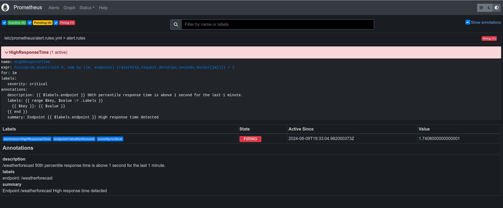
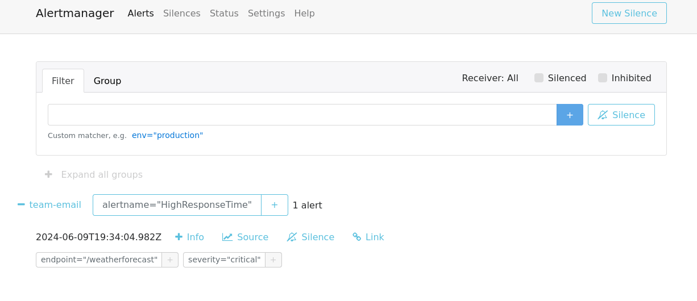
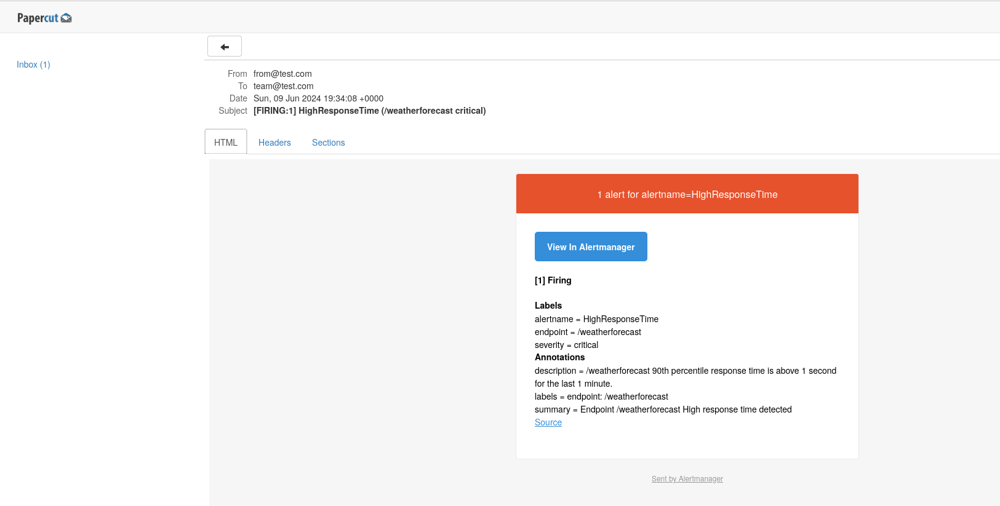

# AlertManager ile Prometheus Alert Yönetimi
Prometheus metrikleri için nasıl Alert kuralları tanımlanıp Alertmanager üzerinden mail gönderme işlemi yapılacağını gösteren örnek uygulamadır.

## Ön Koşullar
* [.NET SDK v8.0+](https://get.dot.net/)
* [Docker Desktop](https://www.docker.com/products/docker-desktop/)

## Kurulum
Demo, C# ile yazılmış birkaç projeden oluşuyor.
* [Web API](src/Api) - HTTP Weather API (ASP.NET Core)

### Portlar 🔌

| Uygulama                | Port(lar)  |
|-------------------------|------------|
| Web API                 | 8181       |
| Prometheus UI           | 9090       |
| Alertmanager UI         | 9093       |
| Papercut Mail Server UI | 37409      |

Web API Prometheus metrik enpoint adresi: `http://localhost:8181/metrics`


### Demoyu Çalıştırmak 🚀
Altyapı bileşenlerini ve uygulamaları birlikte çalıştırmak için [docker-compose.yml](./src/docker-compose.yml) dosyasıyla çalıştırın.

Aşağıdaki komutu çalıştırın ya da Visual Studio üzerinden `docker-compose` projesini çalıştırın.

```shell
>  docker-compose up   
```

## Asp.Net Core Web Api Konfigürayonu

`prometheus-net.AspNetCore` NuGet paketi ilgili projeye eklenir.

[Program.cs](./src/Api/Program.cs) dosyasına `app.MapMetrics()` ve `app.UseHttpMetrics()` eklenir:

```csharp
// ...

app.MapMetrics();
app.UseHttpMetrics();

// ...
```

## Prometheus Konfigürasyonu
- Prometheus api uygulaması metriklerini docker içerisinden `http://api:8080/metrics` (container hostname ve port'u üzerinden) adresi üzerinden çekecek şekilde ayarlanmıştır.
- Alert kuralları `alert.rules.yml` içerisinde tanımlanmıştır.
- Oluşan alert mesajlarının AlertManager'a `alertmanager:9093` adresine yollanacak bir şekilde tanımlanmıştır.

[prometheus.yml](./src/prometheus.yml)

```yml
global:
  scrape_interval: 10s
  scrape_timeout: 5s
rule_files:
  - alert.rules.yml
alerting:
  alertmanagers:
    - scheme: http
      static_configs:
        - targets: [ 'alertmanager:9093' ]
scrape_configs:
  - job_name: "api"
    static_configs:
      - targets: ["api:8080"]
```

- Alert kuralları `alert.rules.yml` dosyasında tanımlanmıştır.
- İçerisinde `HighResponseTime` isimli bir adet alert kuralı tanımlanmıştır.
- `prometheus-net.AspNetCore` kütüphanesinin ürettiği `http_request_duration_seconds_bucket` metriği kullanılarak; Son 1 dakikadır 90. yüzdelik dilimdeki yanıt süresi 1 saniyenin üzerinde olan istekler için alert kuralı tanımlanmıştır.

[alert.rules.yml](./src/alert.rules.yml)

```yml
groups:
  - name: alert.rules
    rules:
      - alert: HighResponseTime
        expr: histogram_quantile(0.9, sum by (le, endpoint) (rate(http_request_duration_seconds_bucket[1m]))) > 1.0
        for: 1m
        labels:
          severity: "critical"
        annotations:
          summary: "Endpoint {{ $labels.endpoint }} High response time detected"
          description: "{{ $labels.endpoint }} 90th percentile response time is above 1 second for the last 1 minute."
```

## Alertmanager Konfigürasyonu
- Mail server olarak [Papercut-SMTP](https://github.com/ChangemakerStudios/Papercut-SMTP) kullanılmıştır.
- Alert mesajlarının `team@test.com` adresine mail olarak gideceği şekilde ayar yapılmıştır.

[alertmanager.yml](./src/alertmanager.yml)

```yml
global:
  smtp_from: 'from@test.com'
  smtp_smarthost: 'mailserver:25'
  smtp_auth_username:
  smtp_auth_password:
templates:
  - '/etc/alertmanager/template/*.tmpl'
route:
  group_by: ['alertname']
  group_wait: 3s
  group_interval: 5s
  repeat_interval: 1h
  receiver: 'team-email'

receivers:
  - name: 'team-email'
    email_configs:
      - to: 'team@test.com'
        send_resolved: true
        require_tls: false
```

## Ekran Görüntüleri
### Prometheus Alert Sayfası


### Alertmanager Alert Sayfası


### Alert E-Mail
