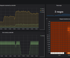
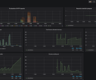

# Prometheus ve Grafana ile ASP.NET Core Web API Monitoring 

Prometheus ve Grafana ile ASP.NET Core Web API metriklerini izlemenin nasıl yapılacağını gösteren örnek uygulamadır.

## Ön Koşullar

* [.NET SDK v8.0+](https://get.dot.net/)
* [Docker Desktop](https://www.docker.com/products/docker-desktop/)

## Kurulum

Demo, C# ile yazılmış birkaç projeden oluşuyor.
* [Web API](src/Api) - HTTP Weather API (ASP.NET Core)

### Portlar 🔌

| Uygulama                | Port(lar)  |
|-------------------------|------------|
| Web API                 | 8181       |
| Prometheus UI           | 9090       |
| Grafana UI              | 3000       |

Grafana UI: kullanıcı adı `admin` şifre `grafana`


### Demoyu Çalıştırmak 🚀

Altyapı bileşenlerini ve uygulamaları birlikte çalıştırmak için [docker-compose.yml](./src/docker-compose.yml) dosyasıyla çalıştırın.

Aşağıdaki komutu çalıştırın ya da Visual Studio üzerinden `docker-compose` projesini çalıştırın.

```shell
>  docker-compose up   
```

## Asp.Net Core Web Api Konfigürayonu

`prometheus-net.AspNetCore` NuGet paketi ilgili projeye eklenir.

`Program.cs` dosyasına `app.MapMetrics()` ve `app.UseHttpMetrics()` eklenir:

```csharp
// ...

app.MapMetrics();
app.UseHttpMetrics();

// ...
```

## Prometheus Konfigürasyonu

Prometheus api uygulaması metriklerini docker içerisinden `http://api:8080/metrics` (container hostname ve port'u üzerinden) adresi üzerinden çekecek şekilde aşağıdaki gibi ayarlanmıştır.

[prometheus.yml](./src/prometheus.yml)

```yml
global: 
  scrape_interval: 10s
  scrape_timeout: 5s
  
scrape_configs:
  - job_name: "api"
    static_configs: 
      - targets: ["api:8080"]
```

## Kullanılan Grafana Dashboardlar

### ASP.NET Core - controller summary (Prometheus)
[](https://grafana.com/grafana/dashboards/10915-asp-net-core-controller-summary-prometheus/)

### prometheus-net
[](https://grafana.com/grafana/dashboards/10427-prometheus-net/)